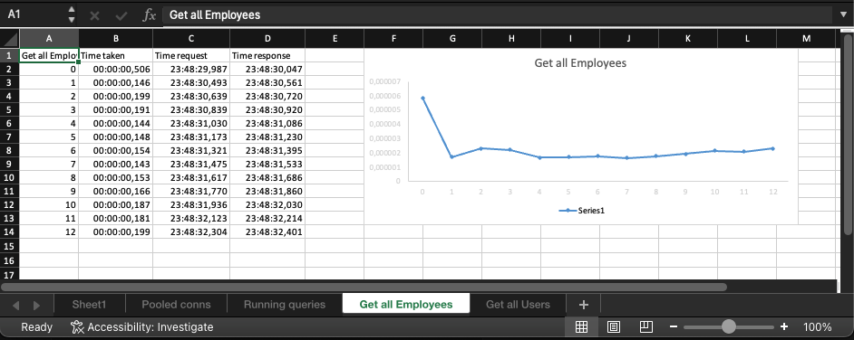

# sqlStat

run SQL queries and collect statistics like query duration, response time with XLSX output

- Currently only MSSQL is supported, but it can be easily extended for other databases

## Purpose

In some cases you need to run SQL queries and collect statistics like query duration, response time, etc.

If SQL profiler or Extended Events is not an option, like you need to run it from application server or you don't have access to SQL Server, you can use this tool to run SQL queries and collect statistics.

## Releases (Windows, MAC, Linux) [https://github.com/mmalcek/sqlStat/releases](https://github.com/mmalcek/sqlStat/releases)

## How it works

- connection to SQL must be configured in config.yaml

```YAML
server: localhost # server name or IP address
instance: SQL2019 # instance name
database: myTestDB # database name
port: 1433 # port number
user: myUser # user name (If empty string, Windows authentication is used)
password: MySuperSecretPassword # password
outputPath: # output path for the generated file "results.xlsx" (If empty string, the files are generated in the current directory)
outputDateMark: false # add date mark to the output file names
```

SQL queries must be stored in the ./queries folder as YAML files in subfolders

### Data queries

- ./queries/data - for queries that return data tables "queries.yaml"

```YAML
name: Running queries
query: |
  SELECT
    "start_time", "status", "database_id", "cpu_time", "total_elapsed_time", "text"
  FROM
    sys.dm_exec_requests
  CROSS APPLY
    sys.dm_exec_sql_text(sql_handle)
```

this will create new sheet(s) with all the data returned by the query

### Duration queries

- ./queries/durartion - for queries that return duration details "employees.yaml"

```YAML
name: Get all Users
repeat: 0
query: |
  SELECT * FROM USERS
  ORDER BY 1
```

- repeat - how many times the query should be repeated

Result Data table

- Time Taken - Duration - duration of the query until all responses are received
- Time Request - time when the request was sent
- Time Response - time when the first response was received

#### Once sqlStat finish it creates **_results.xlsx_** file with all the data


